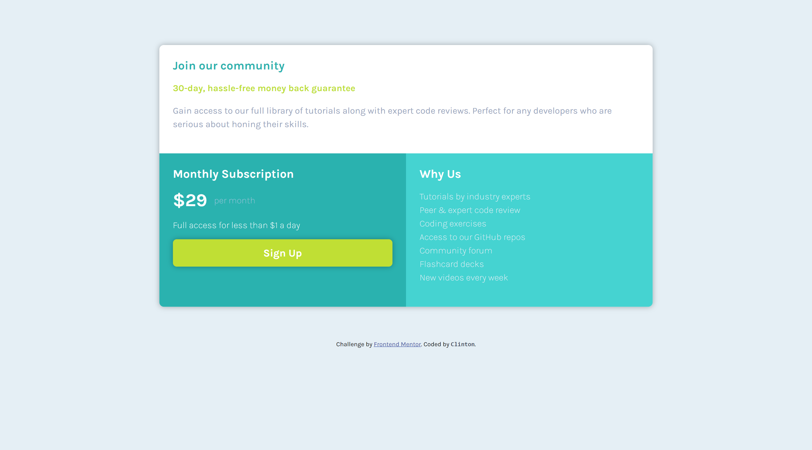

# Frontend Mentor - Single price grid component solution

This is a solution to the [Single price grid component challenge on Frontend Mentor](https://www.frontendmentor.io/challenges/single-price-grid-component-5ce41129d0ff452fec5abbbc). Frontend Mentor challenges help you improve your coding skills by building realistic projects. 

## Table of contents

- [Overview](#overview)
  - [The challenge](#the-challenge)
  - [Screenshot](#screenshot)
  - [Links](#links)
- [My process](#my-process)
  - [Built with](#built-with)
  - [What I learned](#what-i-learned)
  - [Continued development](#continued-development)
  - [Useful resources](#useful-resources)
- [Author](#author)

## Overview

This addresses the challenge of the [Single price grid component challenge on Frontend Mentor], and it has been coded by clintt-09.

Two screenshots are available, showcasing the Desktop and Mobile views. Additionally, there are provided links to both the Solution on Frontend Mentor and the live site hosted on Netlify.

### The challenge

Users should be able to:

- View the optimal layout for the component depending on their device's screen size
- See a hover state on desktop for the Sign Up call-to-action

### Screenshot

Desktop view (1440 x 800)

Mobile view (375 x 870)

### Links

- Solution URL: [Solution on Frontend Mentor](https://your-solution-url.com)
- Live Site URL: [ace-9.netlify.app](https://ace-9.netlify.app/)

## My process

Here are the tools and technologies I employed to address this challenge, insights gained throughout the problem-solving journey, areas in which I aspire to enhance my skills in the coming days, and articles that proved beneficial for me, potentially aiding others in overcoming similar challenges on Frontend Mentor or elsewhere.

This is the approach I took to address this challenge.

### Built with

- Semantic HTML5 markup
- CSS custom properties
- Flexbox
- Mobile-first workflow

### What I learned

Got more initimate with Flexbox as I used it as never before. Getting more mastery over this CSS Layout, still room for more growth...

### Continued development

With this challange done, I finally feel like I have a firm grip on Responsive design. I struggled for months but now I realize the only way to truly learn and understand is through practice. I will only get better from here on out. Its truly euphoric to see my growth. LIVE!

### Useful resources

- [web.dev](https://web.dev/learn) - This site really helped me out more than anything else I found online. It explained Gradients so well that I finally solved the problem that was holding me back from finishing this challenge for weeks (mostly because I kept putting it off). It's a fantastic place to learn not just CSS but everything about web development. Definitely give it a visit!

## Author

- Frontend Mentor - [@clintt-09](https://www.frontendmentor.io/profile/clintt-09)
- Twitter - [@clinttfr](https://www.twitter.com/clinttfr)
